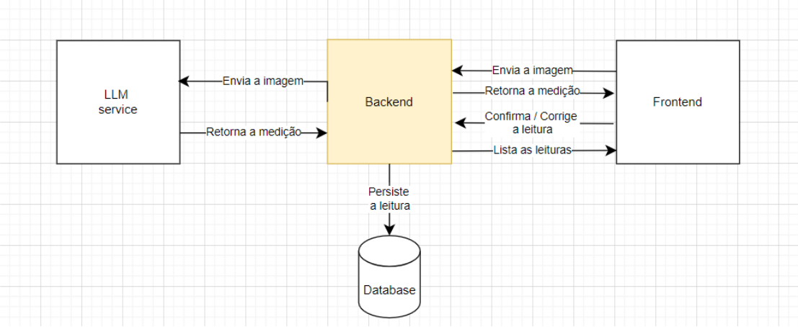
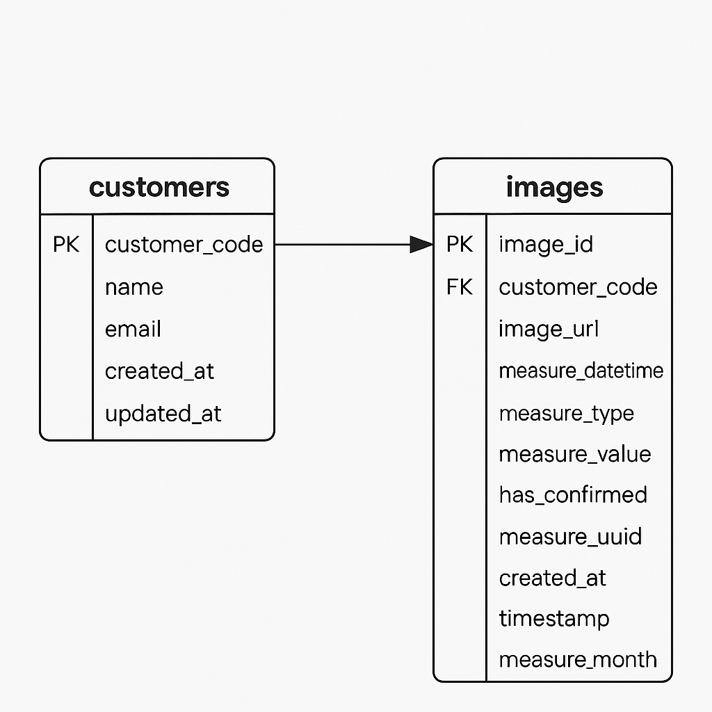

# 🌐 Serviço de Leitura de Imagens | image-reading-backend

Esta aplicação é um back-end de um serviço de leitura de imagens, contendo 3 três endpoints e uma integração com a API do Google Gemini.

## 🏗 Arquitetura

O sistema é desenvolvido em Node.js com TypeScript, utilizando Jest para testes automatizados. Ele roda em contêineres Docker, junto a um banco de dados PostgreSQL com volume persistente. A arquitetura é modular e organizada em camadas, com uso de variáveis de ambiente externas. O sistema gerencia clientes e leituras de medidores (água/gás), utilizando a API do Google Gemini para extrair valores de imagens enviadas em base64.

### 📌 Diagrama do Projeto  


---

## ℹ️ Informações sobre o Backend
1. Desenvolvido em Node.js com TypeScript, com arquitetura modular e organizada em camadas.
2. Utiliza Jest para testes automatizados, com cobertura configurada.
3. Integração com a Google Gemini API para leitura e interpretação das imagens enviadas.
4. Banco de dados PostgreSQL, com tabelas para clientes e leituras mensais de medidores (água/gás), garantindo unicidade por cliente, tipo e mês.
5. Contêineres Docker para app e banco, com volumes persistentes e variáveis de ambiente externas.
6. Leitura de dados segue padrão UTC para consistência de horários.

---

## ⚙️ Etapas de Instalação e Execução

1️⃣ **Configure as variáveis de ambiente:**  
```bash
cp .env.example .env
```
> **Edite o arquivo `.env` conforme necessário.**

2️⃣ **Inicie os containers com Docker:**  
```bash
docker-compose up --build
```

---

### ⛁ Modelo do Banco de Dados


---

## 📖 Documentação da API (Swagger)

A API possui uma documentação interativa gerada com **Swagger**, permitindo testar endpoints diretamente pelo navegador.

🔗 **Acesse a documentação:**  
```plaintext
http://localhost:80/docs/
```

---

## 🔧 Scripts úteis  

### ✅ Executar testes automatizados
```bash
docker-compose exec app npm test
```
ou
```bash
npm test
```

---

## 🛠 Tecnologias utilizadas  
- Node.js  
- TypeScript
- Google Gemini API
- PostgreSQL
- Docker & Docker Compose  
- Jest
- Swagger (OpenAPI)

---

## 📬 Contato  

Caso tenha dúvidas, entre em contato:  

📧 E-mail: [pedroiegler1601@outlook.com](mailto:pedroiegler1601@outlook.com)  

